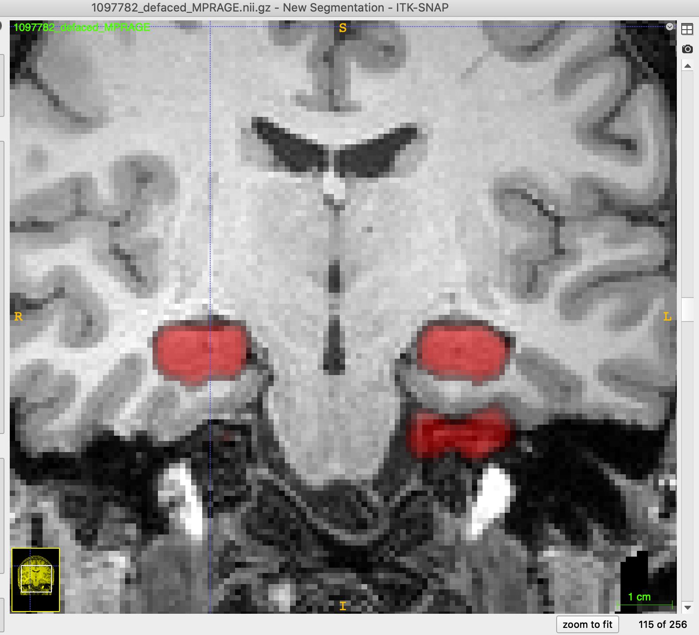

# App:  Hippocampal segmentation

Deep learning app for hippocampal segmentation directly ported from [HippMapp3r](https://www.ncbi.nlm.nih.gov/pubmed/31609046).

## Prerequisites

* [R](https://www.r-project.org) installation
* [ANTsR](https://github.com/ANTsX/ANTsR) installation
* [ANTsRNet](https://github.com/ANTsX/ANTsRNet) installation

or

* python 3
* [ANTsPy](https://github.com/ANTsX/ANTsPy) installation
* [ANTsPyNet](https://github.com/ANTsX/ANTsPyNet) installation

## Sample prediction usage

```
#
#  Usage:
#    Rscript doHippMapp3RSegmentation.R inputImage outputImage
#
#  MacBook Pro 2016 (no GPU)
#

$ Rscript Scripts/doHippMapp3RSegmentation.R Data/Example/1097782_defaced_MPRAGE.nii.gz outputProbabilityMask.nii.gz

```
Rscript Scripts/doHippMapp3RSegmentation.R Data/Example/1097782_defaced_MPRAGE.nii.gz test.nii.gz Data/Template/S_template3_reoreiented.nii.gz

*** Successfully loaded .Rprofile ***

Loading required package: ANTsRCore

Attaching package: ‘ANTsRCore’

The following objects are masked from ‘package:stats’:

    sd, var

The following objects are masked from ‘package:base’:

    all, any, apply, max, min, prod, range, sum

Reading  Data/Example/1097782_defaced_MPRAGE.nii.gz  (elapsed time: 0.223254 seconds)
Reading reorientation template Data/Template/S_template3_reoreiented.nii.gz  (elapsed time: 0.09527993 seconds)
Normalizing to template
  (elapsed time: 0.3082411 seconds)

*************  Initial stage segmentation  ***************

    Initial step 1: bias correction.
  (elapsed time: 11.03883 seconds)
    Initial step 2: threshold.
  (elapsed time: 0.4527068 seconds)
    Initial step 3: standardize.  (elapsed time: 0.3192029 seconds)
    Initial step 4: resample to (160, 160, 128).
  (elapsed time: 0.0003070831 seconds)
    Initial step 5: Load weights.
  (elapsed time: 12.47776 seconds)
    Initial step 6: prediction.
  (elapsed time: 16.7883 seconds)


*************  Refine stage segmentation  ***************

    Refine step 1: crop to the initial estimate.
  (elapsed time: 16.81287 seconds)
    Refine step 2: generate second network and download weights.
  (elapsed time: 3.240857 seconds)
    Refine step 3: do monte carlo iterations (SpatialDropout).
        Doing monte carlo iteration 1 out of 30
        Doing monte carlo iteration 2 out of 30
        Doing monte carlo iteration 3 out of 30
        Doing monte carlo iteration 4 out of 30
        Doing monte carlo iteration 5 out of 30
        Doing monte carlo iteration 6 out of 30
        Doing monte carlo iteration 7 out of 30
        Doing monte carlo iteration 8 out of 30
        Doing monte carlo iteration 9 out of 30
        Doing monte carlo iteration 10 out of 30
        Doing monte carlo iteration 11 out of 30
        Doing monte carlo iteration 12 out of 30
        Doing monte carlo iteration 13 out of 30
        Doing monte carlo iteration 14 out of 30
        Doing monte carlo iteration 15 out of 30
        Doing monte carlo iteration 16 out of 30
        Doing monte carlo iteration 17 out of 30
        Doing monte carlo iteration 18 out of 30
        Doing monte carlo iteration 19 out of 30
        Doing monte carlo iteration 20 out of 30
        Doing monte carlo iteration 21 out of 30
        Doing monte carlo iteration 22 out of 30
        Doing monte carlo iteration 23 out of 30
        Doing monte carlo iteration 24 out of 30
        Doing monte carlo iteration 25 out of 30
        Doing monte carlo iteration 26 out of 30
        Doing monte carlo iteration 27 out of 30
        Doing monte carlo iteration 28 out of 30
        Doing monte carlo iteration 29 out of 30
        Doing monte carlo iteration 30 out of 30
  (elapsed time: 1.555438 seconds)
    Refine step 4: Average monte carlo results and write probability mask image.
  (elapsed time: 0.5017438 seconds)
Renormalize to native space  (elapsed time: 0.6589761 seconds)
  (Total elapsed time: 2.324434 seconds)
```
#
#  Usage:
#    doHippMapp3RSegmentation.py inputImage outputImage reorientationTemplate
#
#  MacBook Pro 2016 (no GPU)
#

$ python3 Scripts/doHippMapp3RSegmentation.py Data/Example/1097782_defaced_MPRAGE.nii.gz testPy.nii.gz Data/Template/S_template3_reoriented.nii.gz
/Library/Frameworks/Python.framework/Versions/3.6/lib/python3.6/site-packages/h5py/__init__.py:36: FutureWarning: Conversion of the second argument of issubdtype from `float` to `np.floating` is deprecated. In future, it will be treated as `np.float64 == np.dtype(float).type`.
  from ._conv import register_converters as _register_converters
Using TensorFlow backend.
Reading  Data/Example/1097782_defaced_MPRAGE.nii.gz
  (elapsed time:  0.4289088249206543  seconds)
Reading reorientation template Data/Template/S_template3_reoriented.nii.gz
  (elapsed time:  0.1439990997314453  seconds)
Normalizing to template
*************  Initial stage segmentation  ***************

    Initial step 1: bias correction.
  (elapsed time:  9.5367431640625e-07  seconds)
    Initial step 2: threshold.
  (elapsed time:  0.10263705253601074  seconds)
    Initial step 3: standardize.
  (elapsed time:  0.12173008918762207  seconds)
    Initial step 4: resample to (160, 160, 128).
  (elapsed time:  0.0  seconds)
    Initial step 5: load weights.
  (elapsed time:  3.453402042388916  seconds)
    Initial step 6: prediction and write to disk.
  (elapsed time:  12.28276515007019  seconds)


*************  Refine stage segmentation  ***************

    Refine step 1: crop image centering on initial mask.
  (elapsed time:  0.01607823371887207  seconds)
    Refine step 2: load weights.
  (elapsed time:  1.8956680297851562  seconds)
    Refine step 3: do monte carlo iterations (SpatialDropout).
        Doing monte carlo iteration 0 out of 30
        Doing monte carlo iteration 1 out of 30
        Doing monte carlo iteration 2 out of 30
        Doing monte carlo iteration 3 out of 30
        Doing monte carlo iteration 4 out of 30
        Doing monte carlo iteration 5 out of 30
        Doing monte carlo iteration 6 out of 30
        Doing monte carlo iteration 7 out of 30
        Doing monte carlo iteration 8 out of 30
        Doing monte carlo iteration 9 out of 30
        Doing monte carlo iteration 10 out of 30
        Doing monte carlo iteration 11 out of 30
        Doing monte carlo iteration 12 out of 30
        Doing monte carlo iteration 13 out of 30
        Doing monte carlo iteration 14 out of 30
        Doing monte carlo iteration 15 out of 30
        Doing monte carlo iteration 16 out of 30
        Doing monte carlo iteration 17 out of 30
        Doing monte carlo iteration 18 out of 30
        Doing monte carlo iteration 19 out of 30
        Doing monte carlo iteration 20 out of 30
        Doing monte carlo iteration 21 out of 30
        Doing monte carlo iteration 22 out of 30
        Doing monte carlo iteration 23 out of 30
        Doing monte carlo iteration 24 out of 30
        Doing monte carlo iteration 25 out of 30
        Doing monte carlo iteration 26 out of 30
        Doing monte carlo iteration 27 out of 30
        Doing monte carlo iteration 28 out of 30
        Doing monte carlo iteration 29 out of 30
  (elapsed time:  82.3516788482666  seconds)
    Refine step 4: Average monte carlo results and write probability mask image.
  (elapsed time:  0.6704068183898926  seconds)
Renormalize to native space
  (elapsed time:  0.4156649112701416  seconds)
Writing testPy.nii.gz
  (elapsed time:  0.209975004196167  seconds)
  (Total elapsed time:  0.209975004196167  seconds)


```

## Sample results


